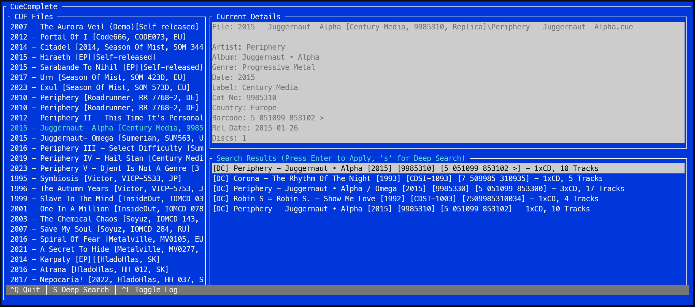

# CueComplete



CueComplete is a Terminal User Interface (TUI) application built with .NET 10. It scans a specified directory for `.cue` files and helps you complete or enrich their metadata.

## Why I Built This

The primary motivation behind CueComplete was a simple but deeply annoying problem: updating existing `.cue` files in my music archive that had randomly missing parts.

## Prerequisites

- [.NET 10.0 SDK](https://dotnet.microsoft.com/download)

## Setup

The application uses external APIs (like Discogs) to fetch metadata. You need to provide your API credentials via a `.env` file located in your user profile directory (e.g., `C:\Users\%USERNAME%\.env` on Windows or `~/.env` on macOS/Linux).

Add your authentication token to your `.env` file. CueComplete prefers a Personal Access Token, but also supports a Consumer Key and Secret as a fallback if the token is omitted.

**Option 1: Personal Access Token (Recommended)**
```env
DISCOGS_PERSONAL_ACCESS_TOKEN=your_personal_access_token
```

**Option 2: Consumer Key & Secret (Fallback)**
```env
DISCOGS_CONSUMER_KEY=your_consumer_key
DISCOGS_CONSUMER_SECRET=your_consumer_secret
```

## Usage

You can run the application directly using the .NET CLI. By default, it will scan the current directory. You can also pass a specific directory path as an argument.

```pwsh
# Run in the current directory
dotnet run

# Run for a specific directory
dotnet run -- "C:\Path\To\Your\Music\Folder"
```

## Features

- **Terminal GUI**: Easy-to-use keyboard-driven interface using `Terminal.Gui`.
- **Recursive Scanning**: Automatically finds all `.cue` files in the given directory and its subdirectories.
- **Metadata Enrichment**: Connects to external services to fetch accurate track and album information.

## Search Logic

CueComplete uses a tiered search strategy to find accurate metadata for your releases.

### Fast Search
The fast search path is designed to save API calls and time. It bypasses MusicBrainz entirely and relies exclusively on Discogs.
- **Criteria:** The source `.cue` data must have either a `CatalogNumber` or a `Barcode` (and Discogs credentials must be configured).
- **Execution:** It queries the Discogs database using the exact identifier.

### Deep Search
The deep search orchestrates a comprehensive, multi-layered lookup across both MusicBrainz and Discogs, leveraging data from one API to enrich data from the other. A deep search is automatically triggered if the source `.cue` file lacks a Catalog Number or Barcode.

1. **Prioritized Discogs Lookup:** If a Catalog Number is present, it is queried against Discogs first.
2. **MusicBrainz Search:** 
   - Uses FreeDB IDs (if present) to resolve to MusicBrainz releases.
   - Falls back to querying MusicBrainz via Barcode or `Artist + Album`.
   - Analyzes MusicBrainz "Relationships" data. If a release links to a Discogs URL, CueComplete fetches the Discogs metadata to enrich the MusicBrainz data.
3. **Discogs Fallback Search:** Collects all unique Discogs IDs and Barcodes found during the MusicBrainz step and queries the Discogs API directly for those specific releases. If nothing is found, it performs a final raw text search on Discogs.

## License

This project is licensed under the MIT License.
