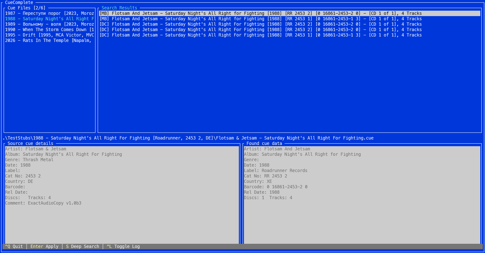

# CueComplete



CueComplete is a Terminal User Interface (TUI) application built with .NET 10. It scans a specified directory for `.cue` files and helps you complete or enrich their metadata.

## Why I Built This

The primary motivation behind CueComplete was a simple but deeply annoying problem: updating existing `.cue` files in my music archive that had randomly missing parts.

## Prerequisites

- [.NET 10.0 SDK](https://dotnet.microsoft.com/download)

## Setup

The application uses external APIs (like Discogs) to fetch metadata. You need to provide your API credentials via a `.env` file located in your user profile directory (e.g., `C:\Users\%USERNAME%\.env` on Windows or `~/.env` on macOS/Linux).

Add your authentication token to your `.env` file. CueComplete prefers a Personal Access Token, but also supports a Consumer Key and Secret as a fallback if the token is omitted.

**Option 1: Personal Access Token (Recommended)**
```env
DISCOGS_PERSONAL_ACCESS_TOKEN=your_personal_access_token
```

**Option 2: Consumer Key & Secret (Fallback)**
```env
DISCOGS_CONSUMER_KEY=your_consumer_key
DISCOGS_CONSUMER_SECRET=your_consumer_secret
```

## Usage

You can run the application directly using the .NET CLI. By default, it will scan the current directory. You can also pass a specific directory path as an argument.

```pwsh
# Run in the current directory
dotnet run

# Run for a specific directory
dotnet run -- "C:\Path\To\Your\Music\Folder"
```

## Features

- **Terminal GUI**: Easy-to-use keyboard-driven interface using `Terminal.Gui`.
- **Recursive Scanning**: Automatically finds all `.cue` files in the given directory and its subdirectories.
- **Metadata Enrichment**: Connects to external services to fetch accurate track and album information.

## Search Logic

CueComplete uses a tiered search strategy combining MusicBrainz and Discogs to identify, cross-reference, and enrich metadata for your releases.

### Identifier Validation & Pre-Processing
Before querying external services, identifiers are extracted and sanitized:
- **Barcodes:** Validated to filter out dummy/placeholder values (e.g. `0000000000000`), matrix, runout, and SID codes.
- **Catalog Numbers & Countries:** Extracted from `.cue` header fields or parsed from directory name metadata tags (e.g., `[1990, JP, WMCP-78]`).
- **Title Annotations:** Parenthetical or bracketed suffix descriptors (such as `(Japan)`, `[Deluxe Edition]`, `(2011 Remaster)`, `[Bonus Tracks]`, `[CD1]`) are detected for fallback queries and country hint extraction.

### Fast Search
The fast search path is designed to save API calls and time when confident identifiers are present:
- **Criteria:** The source `.cue` data must have a `CatalogNumber` or valid `Barcode` (and Discogs credentials must be configured).
- **Execution:** Directly queries Discogs using the exact catalog number or barcode.
- **Auto-Fallback:** If fast search returns no results, CueComplete automatically escalates to **Deep Search**.

### Deep Search
Deep search orchestrates a comprehensive, multi-layered lookup across both MusicBrainz and Discogs, leveraging data from one service to cross-reference and enrich the other:

1. **Prioritized Discogs Catalog Search:** If a Catalog Number is present, it is queried against Discogs first.
2. **MusicBrainz Multi-Stage Resolution:**
   - **MusicBrainz DiscID:** Direct lookup by DiscID. If direct lookup returns 404, queries the MusicBrainz search index (`discid:` / `cdtoc:`), strictly verifying that candidate releases contain the disc ID or match artist and track count to prevent false positives.
   - **FreeDB Lookup:** Resolves FreeDB IDs via MusicBrainz (`/otherlookup/freedbid`) to find matching releases.
   - **Barcode Search:** Queries MusicBrainz index by `barcode:` when a valid candidate is present.
   - **Catalog Number Search:** Queries MusicBrainz index by `catno:` or `artist + catno:` when barcode is absent.
   - **Text Search with Suffix Sanitization Fallback:** Queries `artist:"..." AND release:"..."`. If exact phrase search returns 0 results due to edition/regional suffix pollution (e.g. `(Japan)`), CueComplete automatically strips the annotation and re-queries using the canonical album title.
   - **Discogs Link Enrichment:** Analyzes MusicBrainz URL relationships. If a release links to Discogs, CueComplete fetches the Discogs metadata to enrich tracklists, genres, and identifiers.
   - **Intelligent Ranking:** Multiple MusicBrainz results are scored and prioritized based on catalog number match (+20), regional/country match using alias mapping such as `JP` ↔ `Japan` (+15), and track count match (+10).
3. **Discogs Cross-Referencing & Fallback:**
   - **ID & Barcode Resolution:** Queries Discogs for any Discogs IDs and valid barcodes collected during the MusicBrainz step.
   - **Text Fallback:** If no releases were found via IDs, barcodes, or catalog numbers, performs text search on Discogs. If the original album title yields 0 results, it retries with the sanitized canonical title.
4. **Diacritic & Conjunction Normalization:**
   - Post-search verification across all providers uses diacritic- and case-insensitive comparison (`CompareOptions.IgnoreCase | CompareOptions.IgnoreNonSpace`).
   - Accented characters (`ё` / `е`, `ö`, `é`) and conjunction variants (`&` ↔ `and` / `+`) are normalized to ensure accurate artist matching.

## License

This project is licensed under the MIT License.
